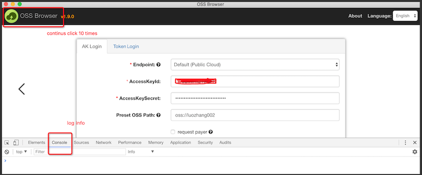
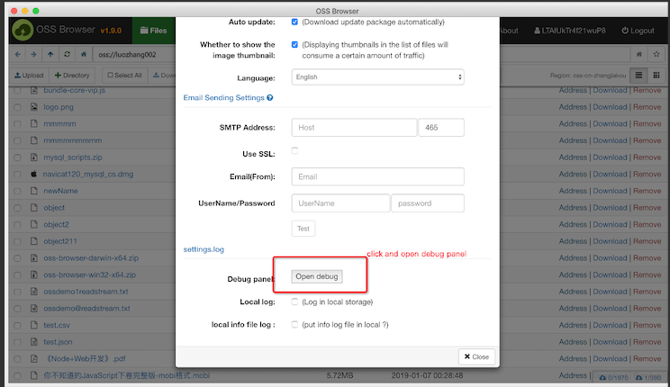

# Quick start

Universal OSS Browser is a graphical management tool that provides features similar to those of Windows Explorer. It now supports arbitrary S3-compatible Object Storage Services (OSS), not just Alibaba Cloud. Using Universal OSS Browser, you can view, upload, download, and manage items with ease.

## [README of Chinese](README-CN.md)

## Platform

Windows 7 above, Linux and Mac. We do not recommend using WindowsXP and WindowServer

## Procedure

1.  Download and install ossbrowser.

    | Supported platform | Download link                                                                                                     |
    | :----------------- |:------------------------------------------------------------------------------------------------------------------|
    | Window x32         | [Window x32](https://github.com/community-oss-browser/oss-browser/releases/download/1.19.1-community/oss-browser-win32-ia32.zip) |
    | Window x64         | [Window x64](https://github.com/community-oss-browser/oss-browser/releases/download/1.19.1-community/oss-browser-win32-x64.zip)  |
    | MAC                | [MAC](https://github.com/community-oss-browser/oss-browser/releases/download/1.19.1-community/oss-browser-darwin-x64.zip)        |
    | Linux x32          | [Linux x32](https://github.com/community-oss-browser/oss-browser/releases/download/1.19.1-community/oss-browser-linux-ia32.zip)  |
    | Linux x64          | [Linux x64](https://github.com/community-oss-browser/oss-browser/releases/download/1.19.1-community/oss-browser-linux-x64.zip)   |

2.  Launch ossbrowser.
3.  Log in to ossbrowser.
4.  Manage buckets. You can do the following:

- create a bucket
- delete a bucket
- modify the ACL for a bucket
- manage the fragments in a bucket.

5.  Manage items. You can do the following:

- upload \(resumable\)
- download \(resumable\)
- delete
- copy
- move
- rename
- search for
- preview an object
- modify the ACL or set an HTTP header of an item.

## Debugging

If you encounter any problems during using ossbrowser, you can switch to the debugging mode and observe the console panel. To switch to the debugging mode, click the icon in the upper left corner (see Figure 1 below) ten times. Note that in post-1.8.0 versions you can also open debug mode in settings page ((see Figure 2 below).


Figure 1


Figure 2

## Qr code

1. OssBrowser answering questions
   
2. Group number:21985509

## Features

- Supports arbitrary S3-compatible Object Storage Services (OSS)
- Works with AWS S3, MinIO, Ceph, Wasabi, DigitalOcean Spaces, and more
- Maintains all original functionality while adding generic support
- Customize endpoint URLs for different storage providers
- Same familiar interface and user experience

## Links

[Universal OSS Browser](https://github.com/fengyucn/uni-oss-browser)

## Running the Application

The application can be run in development mode (recommended):

```bash
npm run dev
```

### Development Mode

Development mode is recommended for daily use as it:
- Automatically watches for file changes and reloads
- Includes debugging tools
- Starts quickly without full build process
- Provides higher stability

### Production Mode

To build and run in production mode:

```bash
npm run build && npm run prod
```

Note: Production mode requires a complete build process and pre-built `dist` directory.

## Debugging

By default, the application will not automatically open developer tools on startup. To open debugging tools:

1. Press F12 (Windows/Linux) or Cmd+Option+I (Mac)
2. Click "Open Debug" in Settings dialog
3. Rapidly click the top-left icon 10 times

For detailed debugging instructions, see [DEBUG-MODES.md](DEBUG-MODES.md).

## Generic OSS Support

For information about using this version with other OSS services, see [GENERIC-OSS-SUPPORT.md](GENERIC-OSS-SUPPORT.md).

## Common Endpoints

The application now includes a dropdown list of common OSS service endpoints for easier configuration. See [COMMON-ENDPOINTS.md](COMMON-ENDPOINTS.md) for details.

## LICENSE

## Debugging

By default, the application will not automatically open developer tools on startup. To open debugging tools:

1. Press F12 (Windows/Linux) or Cmd+Option+I (Mac)
2. Click "Open Debug" in Settings dialog
3. Rapidly click the top-left icon 10 times

For detailed debugging instructions, see [DEBUG-MODES.md](DEBUG-MODES.md).

## Generic OSS Support

For information about using this version with other OSS services, see [GENERIC-OSS-SUPPORT.md](GENERIC-OSS-SUPPORT.md).

## Common Endpoints

The application now includes a dropdown list of common OSS service endpoints for easier configuration. See [COMMON-ENDPOINTS.md](COMMON-ENDPOINTS.md) for details.

## LICENSE

[Apache License 2.0](LICENSE)
